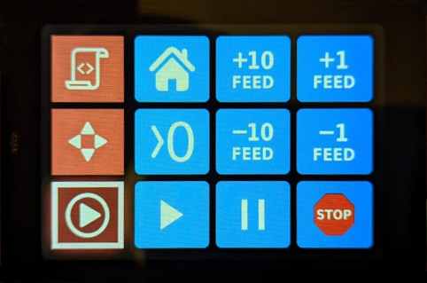

# ESP32 BLE Keypad

This repository contains the FW for the custom BLE Keypad based on WT32-SC01 module. 



## Requirements

PlatformIO (either CLI or as a VSCode extension).

## HowTo

Clone the repository with submodules:

```
git clone --recurse-submodules git@github.com:Sl-Alex/Esp32BleKeypad.git
```

Connect your WT32-SC01 module to the USB port, ensure serial port drivers are installed, then open PlatformIO console, navigate to the folder containing ```platformio.ini``` and run the following:

```
pio run -t upload
```

This will download all the dependencies, build the project and upload the firmware to the module.

## How to use

Just pair with the BLE device called "CNC keypad" and that's it. If you want to use it with ioSender then you need to adjust shortcuts in ioSender. In order to do it do the following:

- Connect to your CNC and run ioSender (I'd recommend using the normal version (not XL) as for now)
- Go to ```Settings: App``` tab and press ```Save keymappings``` button
- Go to the ioSender folder and edit ```KeyMap0.xml```

## Known issues

There is one issue related to the USB type C connector soldered on WT32-SC01 module. The problem is that if you use TypeC <=> TypeC cable then you need to solder two small resistors as described [here](https://sl-alex.net/hw/2022/06/22/WT32-SC01_USB_C_power_fix/). In case if you connect to the old-style type A connector there are no issues.

## Troubleshooting

If your display is blank, try lowering the SPI frequency:

- Open platformio.ini
- Change ```SPI_FREQUENCY``` and ```SPI_READ_FREQUENCY``` to 20MHz
- Rebuild and upload the FW